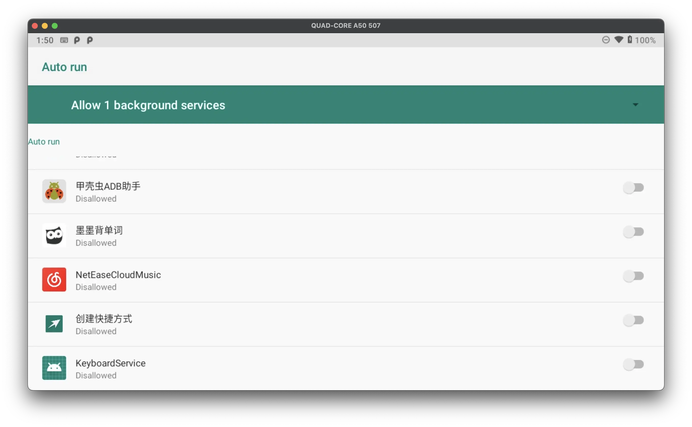
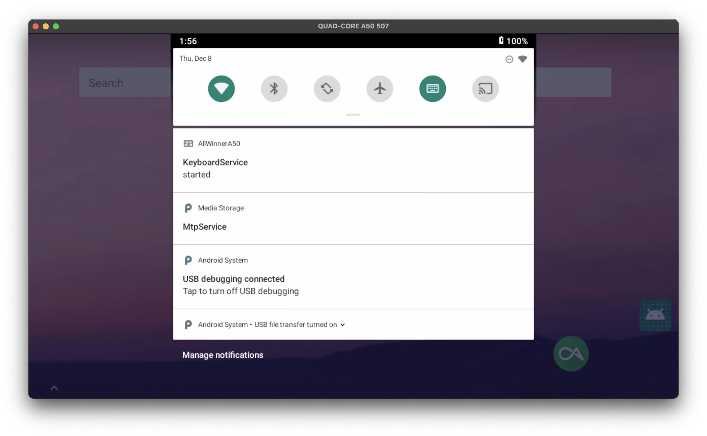

# Calculator AllWinnerA50

This is a repository stored some reverse engineering for an Android calculator using AllWinner A50.

## Install

- Force-stop the original calculator app.

- Download the APK file from Releses, then install it via adb.

- Go to 'System'-'Auto run', allow 'KeyboardService' to run in background.

## Usage

Now pull down the settings panel and add the 'Keyboard' tile, then 'KeyboardService' will be working. Click the tile to toggle its status.

## Key Map

- Number Mode

  

- DPad Mode

  

- Maimemo Mode (same as DPad Mode but those following buttons added)

  

## Misc

TO-DO